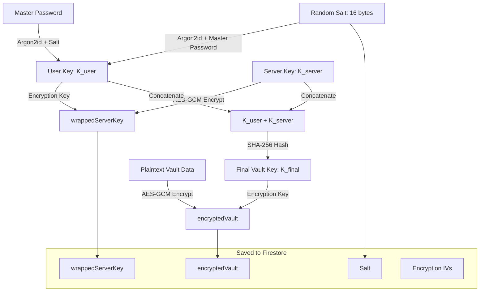

# Sentinel Vault - Zero-Knowledge Password Manager

Sentinel Vault is a secure, client-side encrypted password manager built with **React**, **TypeScript**, **Vite**, and **Tailwind CSS**, backed by **Firebase** (Auth & Firestore). It implements a zero-knowledge security architecture, ensuring all passwords and secrets are encrypted inside your browser before they are ever transmitted or stored online.

---

## 🔒 Security & Cryptographic Architecture

Sentinel Vault relies on robust industry standards for client-side cryptography. The server has no knowledge of your master password, and cannot decrypt your data under any circumstances.



### 1. Key Derivation (Argon2id)
The primary user key ($K_{user}$) is derived from your **Master Password** and a cryptographically secure 16-byte random salt using the **Argon2id** algorithm:
*   **Time Cost (Iterations):** 3
*   **Memory Cost:** 65,536 KB (64 MB)
*   **Parallelism:** 4 threads
*   **Derived Key Length:** 32 bytes (256 bits)

This configuration provides strong resistance against hardware-accelerated dictionary attacks (GPUs/ASICs) and side-channel timing attacks.

### 2. Double-Key Server Wrap
To decouple database authentication from database encryption, a cryptographically secure random 256-bit **Server Key** ($K_{server}$) is generated locally:
*   $K_{server}$ is wrapped (encrypted) locally with $K_{user}$ using **AES-256-GCM** and a unique 12-byte initialization vector (IV).
*   The resulting `wrappedServerKey` and its associated IV are stored in the database.

### 3. Final Vault Key & Encryption
The final key ($K_{final}$) used to encrypt your vault is derived by hashing the concatenation of $K_{user}$ and $K_{server}$ with SHA-256:
$$K_{final} = \text{SHA-256}(K_{user} \mathbin{\Vert} K_{server})$$

Your vault data is serialized into JSON and encrypted with $K_{final}$ using **AES-256-GCM** (with a unique 12-byte IV).

### 4. Memory Sanitization
To defend against memory inspection/scraping attacks:
*   All intermediate cryptographic key buffers ($K_{user}$, $K_{server}$, $K_{final}$) are zeroed out (`clearBuffer`) in memory as soon as the encryption or decryption operation concludes.

---

## ✨ Features

*   **100% Zero-Knowledge System:** Your Master Password is never sent to the network. Cryptographic actions are processed exclusively client-side.
*   **Dual Authentication Methods:** Support for secure **Google Sign-In** OAuth or **Email & Password** authentication.
*   **Auto-Lock Protection:** Monitored browser inactivity (mouse movements, keypresses, clicks, scrolls, touch) automatically locks the vault after 5 minutes of idling. Shows a 60-second warning countdown before locking and securely clears vault data from state.
*   **Secure Password Generator:** An integrated utility to generate high-entropy passwords with configurable parameters (length, uppercase, lowercase, numbers, special symbols).
*   **Master Password Rotation:** Fully supports changing your Master Password. Re-derives new encryption keys and re-encrypts the entire database seamlessly.
*   **Automatic Site Favicons:** Automatically fetches and displays matching high-resolution brand icons for stored credentials, falling back to dynamic unique colorful initials.
*   **Search & Filter:** Find credentials quickly using the real-time search engine and clean category filters (Social, Finance, Work, Email, Other).

---

## 🛠️ Technology Stack

*   **Framework:** React 18, TypeScript, Vite
*   **Styling:** Tailwind CSS 4.0
*   **Icons:** Lucide React
*   **Database & Auth:** Firebase v10 (Auth & Firestore)
*   **Cryptography:** Web Crypto API (native SubtleCrypto) & `argon2-browser` (WASM-based execution)

---

## 📁 Project Directory Structure

```text
├── .github/                # GitHub Actions / Workflows
├── public/                 # Static assets (Argon2 WASM bundles)
├── src/
│   ├── auth/               # Signup/Login cryptographic flow implementations
│   ├── components/         # React components (Vault, AuthCard, Generator, Toast)
│   ├── crypto/             # Cryptographic primitives (argons, AES-GCM, key derivation)
│   ├── firebase/           # Firebase initialization & configurations
│   ├── hooks/              # Custom React hooks (e.g. useAutoLock)
│   ├── storage/            # Firestore storage operations
│   ├── utils/              # Helper utility modules (base64 converters, etc.)
│   ├── App.tsx             # Main React entrypoint
│   ├── index.css           # Global stylesheets
│   └── main.tsx            # DOM initialization
├── .env.example            # Environment template configuration
├── firebase.json           # Firebase Hosting & Database deployment configurations
├── firestore.rules         # Security rules securing Firestore data
├── index.html              # Document entrypoint
└── package.json            # Dependencies & scripts
```

---

## 🚀 Getting Started

### Prerequisites
*   [Node.js](https://nodejs.org/) (Version 18 or higher recommended)
*   [npm](https://www.npmjs.com/) (Version 9 or higher recommended)

### 1. Clone & Install
```bash
git clone https://github.com/yshasvee11/password_manager_web_app.git
cd password_manager_web_app
npm install
```

### 2. Configure Firebase Environment
Create a `.env` file in the root directory by duplicating the example file:
```bash
cp .env.example .env
```
Open `.env` and fill in your Firebase project configuration credentials:
```ini
VITE_FIREBASE_API_KEY=your-api-key-here
VITE_FIREBASE_AUTH_DOMAIN=your-project.firebaseapp.com
VITE_FIREBASE_PROJECT_ID=your-project-id
VITE_FIREBASE_STORAGE_BUCKET=your-project.firebasestorage.app
VITE_FIREBASE_MESSAGING_SENDER_ID=000000000000
VITE_FIREBASE_APP_ID=1:000000000000:web:0000000000000000
VITE_FIREBASE_MEASUREMENT_ID=G-XXXXXXXXXX
```

### 3. Setup Firestore Rules
Ensure your Firestore rules (defined in `firestore.rules`) are deployed to secure documents so users can only read/write their own vaults:
```javascript
rules_version = '2';
service cloud.firestore {
  match /databases/{database}/documents {
    match /users/{userId} {
      allow read, write: if request.auth != null && request.auth.uid == userId;
    }
  }
}
```

### 4. Run Development Server
```bash
npm run dev
```
Open `http://localhost:5173` in your web browser.

---

## 💻 Available Scripts

In the project directory, you can run:

*   `npm run dev` - Launches the Vite development server.
*   `npm run build` - Compiles the production-ready code into the `dist/` directory.
*   `npm run preview` - Runs a local web server serving the production build for testing.
*   `npm run lint` - Code audit using ESLint rules.
*   `npm run typecheck` - Compiles TypeScript files with `--noEmit` to verify type safety.

---

## ☁️ Deployment

You can deploy the app to **Firebase Hosting** using the Firebase CLI:

1. Install Firebase CLI globally (if not already done):
   ```bash
   npm install -g firebase-tools
   ```
2. Authenticate the CLI:
   ```bash
   firebase login
   ```
3. Initialize the hosting environment (already configured, but can be linked using):
   ```bash
   firebase use --add
   ```
4. Build and Deploy:
   ```bash
   npm run build
   ```
   ```bash
   firebase deploy
   ```
