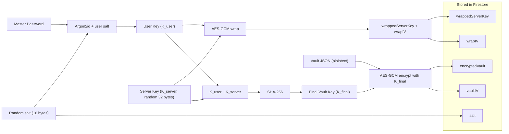

# Sentinel Vault - Zero-Knowledge Password Manager

Sentinel Vault is a client-side encrypted password manager built with React, TypeScript, Vite, and Firebase (Auth + Firestore). Vault data is encrypted in the browser before it is stored, so the server never sees plaintext secrets.

## Security Architecture



### Cryptographic profile

- KDF: Argon2id (`time=3`, `memory=65536 KB`, `parallelism=4`, `length=32`)
- Encryption: AES-256-GCM with per-operation random 12-byte IVs
- Final key derivation: `K_final = SHA-256(K_user || K_server)`
- Key hygiene: temporary key buffers are wiped from memory after use

## Features

- Zero-knowledge vault encryption
- Email/password and Google sign-in
- Auto-lock after inactivity with warning countdown
- Password generator with configurable policy
- Master password rotation (re-encryption flow)
- Search/filter for stored credentials

## Project Structure

```text
.
|-- .github/
|   `-- workflows/                  # CI / Firebase hosting workflows
|-- public/                         # Static assets (Argon2 WASM runtime)
|   |-- argon2-bundled.min.js
|   `-- argon2.wasm
|-- src/
|   |-- auth/                       # Signup/login crypto orchestration
|   |   |-- login.ts
|   |   `-- signup.ts
|   |-- components/                 # UI components
|   |   |-- AuthCard.tsx
|   |   |-- PasswordGenerator.tsx
|   |   |-- Toast.tsx
|   |   `-- Vault.tsx
|   |-- crypto/                     # Crypto primitives and key operations
|   |   |-- encryption.ts
|   |   |-- hash.ts
|   |   `-- keyDerivation.ts
|   |-- firebase/                   # Firebase app/auth/firestore initialization
|   |   `-- config.ts
|   |-- hooks/                      # Custom hooks
|   |   `-- useAutoLock.ts
|   |-- storage/                    # Firestore read/write/auth helpers
|   |   `-- vaultStorage.ts
|   |-- utils/                      # Shared utilities
|   |   `-- base64.ts
|   |-- App.tsx
|   |-- index.css
|   `-- main.tsx
|-- .env.example                    # Environment variable template
|-- .firebaserc                     # Firebase project alias mapping
|-- eslint.config.js
|-- firebase.json                   # Firebase hosting configuration
|-- firestore.indexes.json
|-- firestore.rules
|-- index.html
|-- package.json
|-- tsconfig.json
`-- vite.config.ts
```

### Local/generated directories (not committed)

- `node_modules/`
- `dist/`
- `.firebase/`

## Getting Started

### Prerequisites

- Node.js 18+
- npm 9+

### Install

```bash
npm install
```

### Configure environment

Create `.env` from `.env.example` and fill Firebase values:

```ini
VITE_FIREBASE_API_KEY=...
VITE_FIREBASE_AUTH_DOMAIN=...
VITE_FIREBASE_PROJECT_ID=...
VITE_FIREBASE_STORAGE_BUCKET=...
VITE_FIREBASE_MESSAGING_SENDER_ID=...
VITE_FIREBASE_APP_ID=...
VITE_FIREBASE_MEASUREMENT_ID=...
```

### Run

```bash
npm run dev
```

### Build

```bash
npm run build
```

## Deployment

Deploy to Firebase Hosting:

```bash
npm run build
firebase deploy
```
